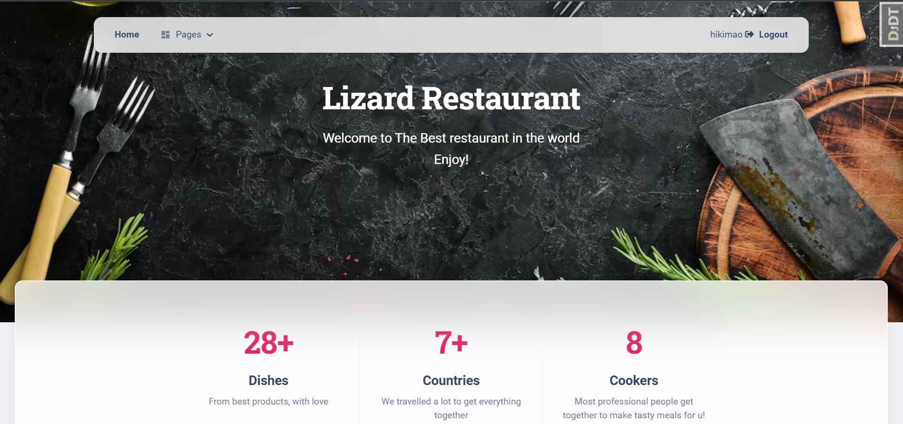

# Restaurant kitchen service
This project was created to help restaurant with managing dishes and cookers.
## Check it out!


## Credential for testing:
username = user
password = usercango56

## Installing / Getting started

Python3 must be already installed

```shell
git clone https://github.com/Maytreyaya/restaurant-kitchen-service
pip install -r  requirements.txt
python manage.py runserver
```
### Features

#Authentication
#Add dishes to Menu
#Delete dishes
#Create New Cookers
#Delete Cookers


### Demo


